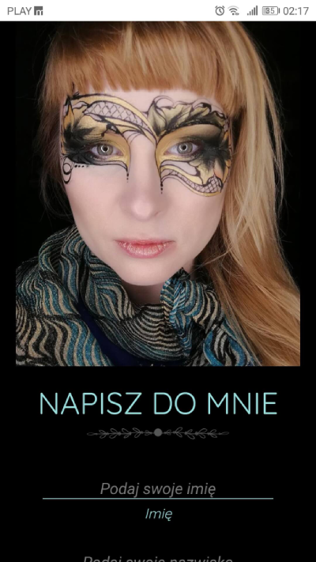

# AwesomeBlossomArt Event App

Own project (work in progress).

The aim of the project is to create a website for the face painting artist.

Main page consists of 4 sections:
* Home
* About
* Offer
* Contact

Technologies used:
* HTML
* Sass
* JavaScript
* RWD
* Gulp

Next steps in project's development:

* adding contact form validation and functionality
* adding subpage with gallery with 3 sections (children, adults, bellies, trainings)
* adding subpages with offer descriptions
* modifying event app ("Szkolenia" tab - separate project)

Preview:

https://nyziek.pl/projects/awesomeblossomart/

Screenshots:

* Desktop:

* Mobile: 

